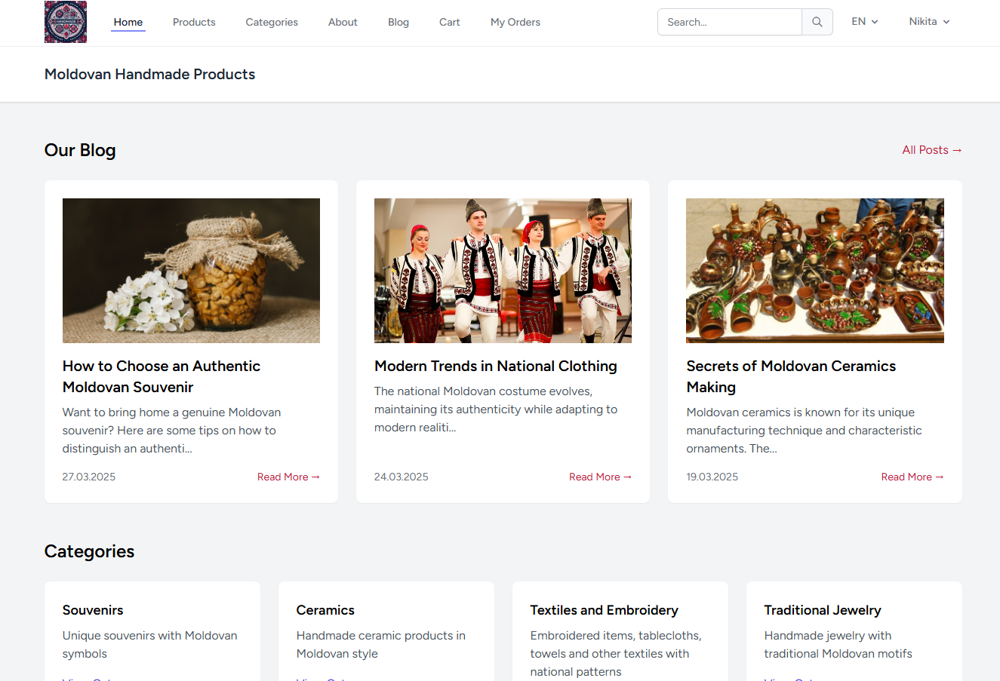
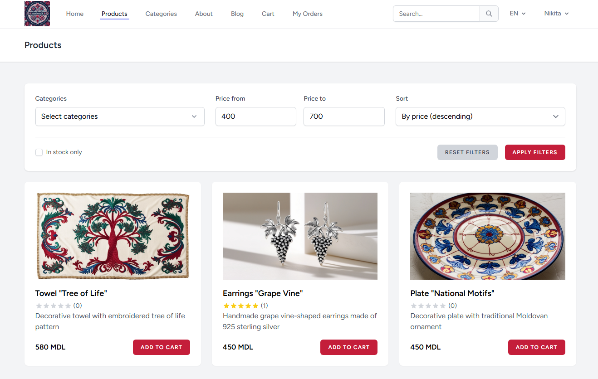
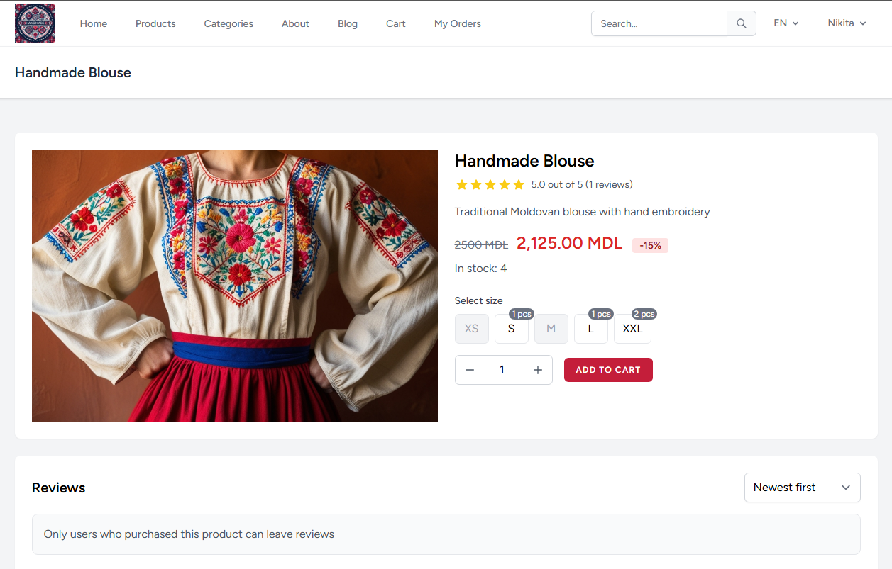
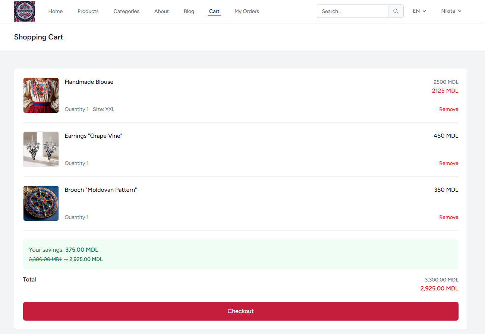
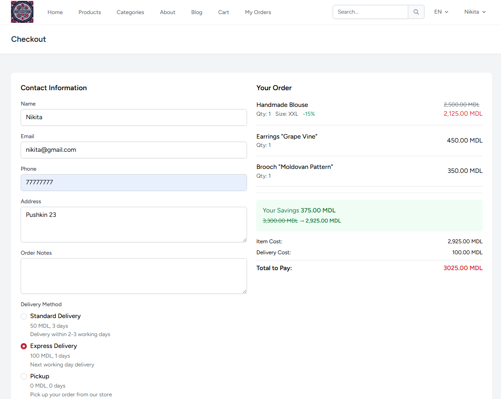
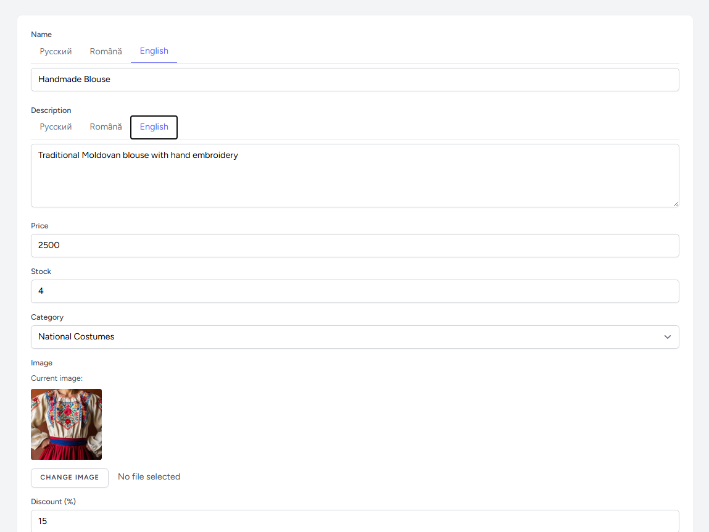

# Online Store

   

A modern, feature-rich e-commerce platform built with Laravel that provides a seamless shopping experience for customers and comprehensive management tools for administrators.

## Table of Contents

- [Description](#description)
- [Features](#features)
- [Technologies Used](#technologies-used)
- [Project Structure](#project-structure)
- [Installation](#installation)
- [Usage](#usage)
- [Screenshots](#screenshots)
- [Deployment](#deployment)
- [License](#license)
- [Contact](#contact)
- [Acknowledgments](#acknowledgments)

## Description

This online store is a full-featured e-commerce solution designed to handle all aspects of online retail business. The platform offers an intuitive user interface for customers to browse products, manage their shopping cart, and complete purchases, while providing administrators with powerful tools to manage inventory, orders, and customer relationships.

## Features

### Customer Features
- 🛍️ **Product Catalog** - Browse products with detailed descriptions, images, and specifications
- 🛒 **Shopping Cart** - Add, remove, and manage items with real-time price calculations
- 👤 **User Authentication** - Secure registration, login, and profile management
- 🔍 **Advanced Search & Filtering** - Find products by category, price range, and availability
- ⭐ **Product Reviews & Ratings** - Read and write product reviews with star ratings
- 📱 **Responsive Design** - Optimized for desktop, tablet, and mobile devices
- 🌐 **Multi-language Support** - Available in multiple languages (RU, RO, EN)
- 💰 **Discount System** - Automatic discount calculations and promotional pricing
- 📦 **Order Tracking** - Track order status from placement to delivery
- 📍 **Multiple Delivery Options** - Various shipping methods with cost calculations

### Admin Features
- 📊 **Admin Dashboard** - Comprehensive overview of store performance
- 📦 **Product Management** - Add, edit, and delete products with inventory tracking
- 🏷️ **Category Management** - Organize products into categories and subcategories
- 📋 **Order Management** - Process orders, update status, and manage fulfillment
- 👥 **User Management** - View and manage customer accounts
- 📈 **Sales Analytics** - Track sales performance and generate reports
- 💬 **Review Moderation** - Manage customer reviews and respond as admin
- 🎯 **Discount Management** - Create and manage promotional campaigns

### Technical Features
- 📧 **Email Notifications** - Automated order confirmations and updates
- 🗄️ **Database Optimization** - Efficient data storage and retrieval

## Technologies Used

### Backend
- **PHP 8.1+** - Server-side programming language
- **Laravel 10** - PHP web application framework
- **SQLite** - Database management system
- **Eloquent ORM** - Database abstraction layer

### Frontend
- **Blade Templates** - Laravel's templating engine
- **HTML5 & CSS3** - Modern web standards
- **JavaScript** - Client-side interactivity
- **Tailwind CSS** - Utility-first CSS framework
- **Vite** - Frontend build tool

### Additional Libraries & Tools
- **Spatie Laravel Translatable** - Multi-language support
- **Laravel Breeze** - Authentication scaffolding
- **Laravel Sanctum** - API authentication
- **Composer** - PHP dependency management
- **NPM** - JavaScript package management

## Project Structure

```
├── app/
│   ├── Http/Controllers/       # Application controllers
│   ├── Models/                 # Eloquent models
│   ├── Services/              # Business logic services
│   └── Notifications/         # Email notifications
├── database/
│   ├── migrations/            # Database migrations
│   ├── seeders/              # Database seeders
│   └── factories/            # Model factories
├── resources/
│   ├── views/                # Blade templates
│   ├── css/                  # Stylesheets
│   └── js/                   # JavaScript files
├── routes/
│   ├── web.php               # Web routes
│   └── auth.php              # Authentication routes
├── public/                   # Public assets
├── storage/                  # File storage
└── tests/                    # Unit and feature tests
```

## Installation

### Prerequisites
- PHP 8.1 or higher
- Composer
- Node.js & NPM
- MySQL or SQLite
- Web server (Apache/Nginx) or Laravel's built-in server

### Steps

1. **Clone the repository**
   ```bash
   git clone https://github.com/S1ngle777/Online-store.git
   cd Online-store
   ```

2. **Install PHP dependencies**
   ```bash
   composer install
   ```

3. **Install JavaScript dependencies**
   ```bash
   npm install
   ```

4. **Environment configuration**
   ```bash
   cp .env.example .env
   php artisan key:generate
   ```

5. **Configure database**
   Edit the `.env` file with your database credentials:
   ```env
   DB_CONNECTION=sqlite
   # DB_HOST=127.0.0.1
   # DB_PORT=3306
   # DB_DATABASE=database/database.sqlite
   # DB_USERNAME=root
   # DB_PASSWORD=
   ```

6. **Run database migrations and seeders**
   ```bash
   php artisan migrate --seed
   ```

7. **Create storage symlink**
   ```bash
   php artisan storage:link
   ```

8. **Build frontend assets**
   ```bash
   npm run build
   ```

9. **Start the development server**
   ```bash
   php artisan serve
   ```

10. **Access the application**
    Open your browser and navigate to `http://localhost:8000`

### Default Admin Account
After running the seeders, you can log in with:
- **Email**: admin@gmail.com
- **Password**: adminadmin

## Usage

### For Customers
1. **Browse Products**: Visit the homepage to see featured products and categories
2. **Search & Filter**: Use the search bar and filters to find specific products
3. **Product Details**: Click on any product to view detailed information and reviews
4. **Add to Cart**: Select size (if applicable) and add products to your shopping cart
5. **Checkout**: Proceed to checkout, fill in delivery details, and complete your order
6. **Track Orders**: View your order history and track current orders in your profile

### For Administrators
1. **Admin Access**: Log in with admin credentials
2. **Manage Products**: Navigate to the admin panel to add, edit, or remove products
3. **Process Orders**: Monitor incoming orders and update their status
4. **Manage Categories**: Create and organize product categories
5. **Review Management**: Moderate customer reviews and provide admin responses

## Screenshots

### Homepage


### Product Catalog


### Product Details


### Shopping Cart


### Checkout Process


### Product Management


## Deployment

### Production Deployment
1. Set `APP_ENV=production` in `.env`
2. Set `APP_DEBUG=false` in `.env`
3. Configure your web server
4. Set up SSL certificates
5. Configure caching:
   ```bash
   php artisan config:cache
   php artisan route:cache
   php artisan view:cache
   ```

### Environment Variables
Key environment variables to configure:
- `APP_URL` - Your domain URL
- `MAIL_*` - Email service configuration
- `DB_*` - Database connection settings

## License

This project is licensed under the MIT License - see the [LICENSE](LICENSE) file for details.

## Contact

- **Developer**: Nikita
- **Email**: nniebogha@gmail.com
- **GitHub**: [@S1ngle777](https://github.com/S1ngle777)
- **Project Repository**: [Online-store](https://github.com/S1ngle777/Online-store)

## Acknowledgments

- Laravel community for the excellent framework
- Open source libraries that made this project possible

---

**Made with ❤️ using Laravel**
